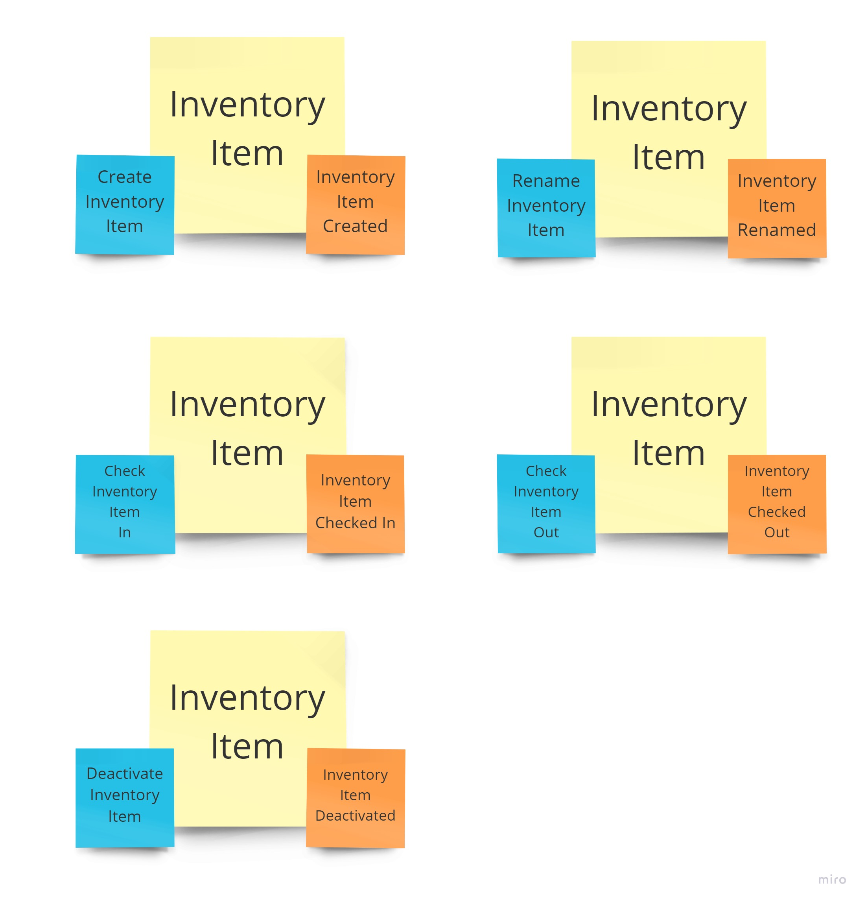

# Step 03 : Implementing our domain

To continue this workshop, we will use a fairly naive domain : an inventory system. Our goal here is to understand how to write an event-sourced system, not to implement a complex domain.

## Discovering the domain with *Event Storming*

The best way to explore a domain is most definitely through [Event Storming](https://www.eventstorming.com/). Here, we will not enter into details on how to run an *Event Storming* session. There are many resources out there you can find on the subject; including [Alberto Brandolini's book](https://www.eventstorming.com/book/). This is not the point of this workshop. We do recommend that you get familiar with *Event Storming* though, since most of the *Domain-Driven Design* recognize it as **the best tool** for domain modeling.

Usually, the output of an *Event Storming* session would probably be photos of sticky notes. For this workshop, we will simulate an *Event Storming* and use pixels instead of actual sticky notes.



*Event Stormers* use some conventions regarding colors. It's not mandatory, but it's usually better to stick to this convention to make your model generally understandable by the community.

Colors are generally:

* Orange sticky : Event
* Blue sticky : Command
* Larger yellow sticky : Aggregate

We have talked about *event* and *aggregate* before, but what is a command ?

## Command and command handlers

A *command* is the way the user will interact with the system. It is an order given by the user to the system to execute some kind of process. The command will be handled by the system and applied to an aggregate, that will generate one or more events.

### Command

A `Command` is a special type of `Message` that represents a user decision, an action request sent to the system. It has a unique id and the system should take care of implementing [idempotence](https://en.wikipedia.org/wiki/Idempotence). The `id` will be useful for that.

A command will generally apply to a given *aggregate*, so it is safe to assume that there should be an `aggregateId`.

```Java
public abstract class Command implements Message {
    public UUID id;
    public UUID aggregateId;
```

### Command handler

A *command* should be handled by the system. We need to add the notion of a `CommandHandler`, that will be generic to handle any kind of command.

```Java
public interface CommandHandler<T extends Command> {
    public void handle(T command);
}
```

A `CommandHandler` will generally do three things:

1. Create or load the *aggregate*
2. Call a public method on the *aggregate*, using the parameters provided in the *command*, to trigger some kind of business behavior.
3. Save the *aggregate*.

To create the *aggregate*, we will need a *factory* that will ensure the *aggregate* is in a correct initial state. A [factory method](https://en.wikipedia.org/wiki/Factory_method_pattern) is quite useful for that. 

Loading and saving the *aggregate* is delegated to another component that is called a `Repository`.

### Repository

A `Repository` has two methods, one for loading, one for saving.

```Java
public interface Repository<T extends AggregateRoot> {
    public T getById(UUID id);
    public void save(T aggregate);
}
```

## Implementing the domain

Now that we have all we need, how would we move on implementing the domain. Well, let's start with implementing our first use case *Creation* and then we will move to the next.

The development cycle for each use case will mostly be the same:

1. Define the command
2. Add a new public method to the aggregate
3. Define the domain event(s)
4. Define the command handler
5. Write some tests

This flow would be slightly different if we were doing TDD, but for the sake of your understanding, let's not.

First, we need to create a new folder *domain* for our domain code *app/src/**main**/java/net/agilepartner/workshops/cqrs* and our tests *app/src/**test**/java/net/agilepartner/workshops/cqrs*

### Create inventory item

#### Create inventory item command

We need a *command* that will allow us to define the name of the inventory item and the initial quantity. The `aggregateId` will be randomly generated at this point, as well as the `id` of the *command* itself.

```Java
public class CreateInventoryItem extends Command {

    private static final long serialVersionUID = 1L;

    public String name;
    public int initialQuantity;

    public static CreateInventoryItem Create(String name, int initialQuantity) {
        CreateInventoryItem cmd = new CreateInventoryItem();
        cmd.id = UUID.randomUUID();
        cmd.aggregateId = UUID.randomUUID();
        cmd.name = name;
        cmd.initialQuantity = initialQuantity;

        return cmd;
    }
}
```

#### Create inventory item aggregate

```Java

```

#### Create inventory item event

```Java

```

#### Create inventory item command handler

```Java

```

#### Test create inventory item

```Java

```

### Rename inventory item

### Check inventory item in

### Check inventory item out

### Deactivate inventory item
